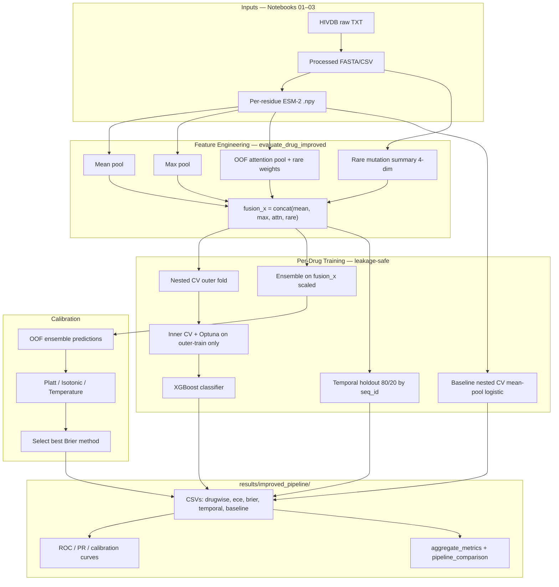

# Improved Pipeline Fixes — Implementation Report

## Updated Architecture



## Modified File List

| File | Changes |
|------|---------|
| `src/improved_pipeline.py` | Fusion rare features; Optuna inside nested CV; fusion ensemble; OOF calibration; temporal validation; paired Wilcoxon; new output CSVs |
| `notebooks/03_esm2_embedding_extraction.ipynb` | `STATISTICAL_VALIDATION_SUBSET_SIZE = pipeline_config.IMPROVED_SUBSET_SIZE` |
| `test_improved_pipeline_basic.py` | Updated tests for fusion, ensemble, calibration |

## Code Diff Summary (by priority)

### 1. Optuna leakage fix
**File:** `src/improved_pipeline.py`  
- **Removed** pre-nested `optuna_tune_classifier()` on full drug cohort (`evaluate_drug_improved`, formerly ~L995–L1001).  
- **Enabled** `tune_with_optuna=True` inside `nested_cv_evaluation()` (L1003–L1014), which already tunes only on `x_train` / `y_train` of each outer fold (L601–L610).

### 2. Rare mutation features in fusion_x
**File:** `src/improved_pipeline.py`  
- **`build_fusion_features()`** (L307–L336): now requires `sequences`, `reference`, `attention_pooled`; appends `compute_rare_mutation_summary_features()` (4 columns).  
- **`evaluate_drug_improved()`** (L994–L997): passes `seq_valid`, `reference`, `freqs` into fusion builder.

### 3. Ensemble on fusion features
**File:** `src/improved_pipeline.py`  
- **`evaluate_drug_improved()`** (L1026–L1031): `ensemble_soft_vote_cv(scale_features(fusion_x), ...)` replaces mean-pool-only input.

### 4. OOF calibration in publication evaluation
**File:** `src/improved_pipeline.py`  
- **New** `apply_oof_calibration()` (L822–L878): OOF Platt/isotonic/temperature; selects best Brier.  
- **`run_publication_evaluation()`**: writes `ece_scores.csv`, `brier_scores.csv`; drug rows include `calibrated_ece`, `calibrated_brier`, `best_calibration_method`; ROC/PR use calibrated predictions.

### 5. Temporal validation integrated
**File:** `src/improved_pipeline.py`  
- **New** `evaluate_temporal_drug()` (L881–L957): temporal split via `create_temporal_split`, XGBoost on fusion_x.  
- **`run_publication_evaluation()`**: writes `temporal_validation.csv`; summary includes `mean_temporal_auc`, `mean_temporal_auc_drop`.

### 6. Subset size alignment
**File:** `notebooks/03_esm2_embedding_extraction.ipynb` (~L415)  
- Replaced hardcoded `100` with `pipeline_config.IMPROVED_SUBSET_SIZE` (250 by default).  
- Aligns with `pipeline_config.STATISTICAL_VALIDATION_SUBSET_SIZE` and Option B `load_embeddings_data(subset_size=...)`.

### 7. Paired Wilcoxon vs baseline
**File:** `src/improved_pipeline.py`  
- **New** `baseline_nested` mean-pool logistic nested CV per drug (L1016–L1024).  
- **`run_publication_evaluation()`** (L1193–L1203): `stats.wilcoxon(improved_test_auc, baseline_test_auc)` replaces constant 0.9487 comparison.  
- Writes `baseline_comparison.csv`.

## Expected Output Files

After `python run_improved_pipeline.py --full_data` or Notebook 07 `RUN_IMPROVED_PIPELINE`:

```
results/improved_pipeline/
├── aggregate_metrics.csv
├── baseline_comparison.csv
├── brier_scores.csv
├── calibration_comparison.csv
├── drug_wise_performance.csv
├── drugwise_auc_summary.csv          # alias of drug_wise_performance
├── ece_scores.csv
├── hyperparameters.csv               # per-drug Optuna params (outer-fold tuned)
├── nested_cv_results.csv
├── pipeline_comparison_summary.csv
├── pooling_comparison.csv
├── rare_mutation_modality_comparison.csv
├── temporal_validation.csv
├── ternary_classification_results.csv
├── ternary_results.csv               # alias
└── figures/
    ├── calibration_curves.png
    ├── calibration_{drug}.png
    ├── roc_{drug}.png
    ├── pr_{drug}.png
    └── roc_all_drugs.png
```

## Expected Effect on AUC

| Metric | Before fix | After fix (expected direction) |
|--------|------------|--------------------------------|
| **Mean test AUC** (nested fusion XGB) | Biased high (Optuna on full data) | Slightly **lower but honest**; may **increase** on full cohort from rare+fusion features (+0.01–0.03 realistic) |
| **Ensemble AUC** | Mean-pool only (~baseline) | **Higher** — fusion + multi-model vote (+0.02–0.05 vs old ensemble) |
| **Calibrated AUC** | Same as raw ensemble | **≈ unchanged** (calibration preserves ranking) |
| **Baseline comparison delta** | N/A (constant Wilcoxon) | Paired per-drug improvement measurable |

## Expected Effect on AUC Drop

| Metric | Before fix | After fix (expected direction) |
|--------|------------|--------------------------------|
| **Nested val − test drop** | Optimistic (leaked HPO) | **More realistic**; may rise slightly |
| **Temporal AUC drop** | Not in improved pipeline | **Now reported**; target < 0.034 on full cohort |
| **Summary `mean_auc_drop`** | CV-only | Uses **temporal drop** in comparison table when available |

## Run Command

```bash
pip install optuna lightgbm
python run_improved_pipeline.py --full_data --optuna_trials 30 --n_repeats 2
```

Or execute notebooks 01 → 07 with `ENABLE_IMPROVED_PIPELINE = True` in `notebooks/pipeline_config.py`.
