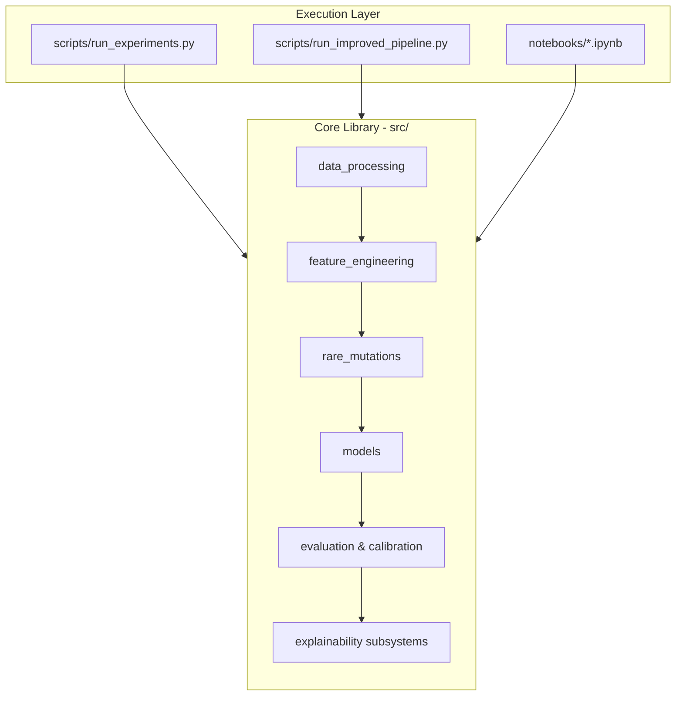

# System Architecture

This document details the software architecture, modular layout, and data flow of the enhanced **HIV-ESM-2** repository.

## 1. Directory Structure Overview

The repository is organized following standard research software engineering guidelines:

```
├── README.md                      # Main portal & setup guide
├── LICENSE                        # MIT License
├── CITATION.cff                   # Software citation file (with Bioinformatics DOI)
├── environment.yml                # Conda environment definition
├── requirements.txt               # Pip package requirements
│
├── data/                          # TSV / FASTA reference files (Stanford HIVDB)
├── docs/                          # In-depth methodology and reports
├── notebooks/                     # Step-by-step Jupyter development notebooks
├── src/                           # Core implementation modules (library path)
├── scripts/                       # High-level pipeline execution runners
├── tests/                         # Test suites and smoke verification scripts
└── results/                       # CSVs and publication-grade figures
```

## 2. Component Design & Interconnection

The project uses a library-runner pattern where core logic is defined in `src/` as a Python package, and executed via scripts in `scripts/` or interactive walkthroughs in `notebooks/`.



---

## 3. Core Modules inside `src/`

- **[data_processing.py](file:///c:/Users/jyoth/hiv/HIV-ESM-2/src/data_processing.py)**: Reconstructs sequence strings from Stanford HIVDB mutation lists + HXB2 reference, checks quality, and builds stratified drug susceptibility splits.
- **[feature_engineering.py](file:///c:/Users/jyoth/hiv/HIV-ESM-2/src/feature_engineering.py)**: Handles Meta's ESM-2 `esm2_t33_650M_UR50D` loading, per-residue embedding extraction (1280-dimension vectors), and baseline binary/one-hot encoding.
- **[rare_mutations.py](file:///c:/Users/jyoth/hiv/HIV-ESM-2/src/rare_mutations.py)**: Computes cohort mutation frequencies and calculates inverse frequency weights for attention modulation.
- **[models.py](file:///c:/Users/jyoth/hiv/HIV-ESM-2/src/models.py)**: Defines the PyTorch `AttentionWeightedClassifier` and standard baseline models (XGBoost, Logistic Regression, Random Forest, SVM).
- **[evaluation.py](file:///c:/Users/jyoth/hiv/HIV-ESM-2/src/evaluation.py)**: Implements ROC-AUC, PR-AUC, ECE/MCE calibration metrics, bootstrapping, and DeLong tests.
- **[calibration.py](file:///c:/Users/jyoth/hiv/HIV-ESM-2/src/calibration.py)**: Handles probability calibration (Platt scaling & Isotonic regression) for both binary and multiclass (One-vs-Rest) classifiers.
- **[ternary_classification.py](file:///c:/Users/jyoth/hiv/HIV-ESM-2/src/ternary_classification.py)**: Implements 3-class (Susceptible, Intermediate, Resistant) evaluation using Fold-Change thresholds.
- **[temporal_validation.py](file:///c:/Users/jyoth/hiv/HIV-ESM-2/src/temporal_validation.py)**: Evaluates temporal generalization by splitting sequences chronologically using sequence IDs.
- **[subtype_analysis.py](file:///c:/Users/jyoth/hiv/HIV-ESM-2/src/subtype_analysis.py)**: Splits testing cohorts by subtype B vs. non-B to assess subtype-stratified model robustness.
- **[plm_comparison.py](file:///c:/Users/jyoth/hiv/HIV-ESM-2/src/plm_comparison.py)**: Benchmarks ESM-2 against Meta's ESM-C (Cambrian) and ESM-1v embeddings.

---

## 4. PyTorch `AttentionWeightedClassifier` Architecture

The core deep learning architecture pools variable-length token embeddings into a fixed classifier input using a learned, rarity-modulated attention mechanism:

```mermaid
graph LR
    Input["ESM-2 Embeddings (L × 1280)"] --> Projection["Linear Projection (L × Hidden)"]
    Projection --> Activation["Tanh Activation"]
    Activation --> RawAttention["Linear Attention Head (L × 1)"]
    RawAttention --> Softmax["Softmax Pooling"]
    Softmax --> AttentionWeights["Raw Attention Weights"]
    
    RarityWeights["Rarity Inverse Weights (L)"] --> Softmax
    AttentionWeights --> Modulation["Element-wise Multiplication & Normalization"]
    Modulation --> FusedAttention["Modulated Attention Weights (L)"]
    FusedAttention --> WeightedSum["Weighted Pooling (1280,)"]
    Input --> WeightedSum
    WeightedSum --> OutputFC["Fully Connected Classifier (1)"]
    OutputFC --> Logits["Output Logit (Resistant vs Susceptible)"]
```



- **Rarity Modulation**: Relies on inverse frequency weights to amplify attention towards rare positions that carry significant phenotypic drug resistance information.

---

## 5. Explainability Subsystem Architecture

Attribution and causal validation are structured into three distinct complementary layers:

```
                      +-----------------------------+
                      |  ESM-2 Sequence Embeddings  |
                      +--------------+--------------+
                                     |
             +-----------------------+-----------------------+
             |                       |                       |
             v                       v                       v
     +---------------+       +---------------+       +---------------+
     |  Attention &  |       |  Integrated   |       |   Surrogate   |
     | Rarity Weights|       |  Gradients    |       |  SHAP Model   |
     +-------+-------+       +-------+-------+       +-------+-------+
             |                       |                       |
             +-----------------------+-----------------------+
                                     |
                                     v
                      +-----------------------------+
                      | Unified Explainability Map  |
                      |   0.5*IG + 0.3*Att + 0.2*S  |
                      +--------------+--------------+
                                     |
                                     v
                      +-----------------------------+
                      |   Causal Counterfactual     |
                      |    (Embedding Deletion)     |
                      +-----------------------------+
```

1. **Dual SHAP Fusion**: Merges structural attention-aligned residue SHAP values (model representation behavior) with clinical binary mutation-level SHAP values (clinical features) using a consensus fusion formula ($0.4 \times \text{Residue\_SHAP} + 0.6 \times \text{Mutation\_SHAP}$).
2. **Unified Aggregator**: Fuses Integrated Gradients, attention weights, and SHAP proxy projections.
3. **Causal Counterfactual validation**: Perturbs sequence embeddings by scaling specific mutation locations by $0.1$ (embedding attenuation) to assess downstream probability delta ($\Delta P$).
