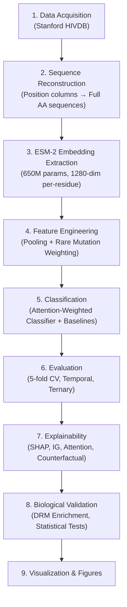

# HIV Drug Resistance Prediction with ESM-2 — Complete Pipeline Summary

## 🎯 Project Goal
Predict HIV drug resistance from protein sequences using **ESM-2 protein language model embeddings**, covering **18 antiretroviral drugs** across 3 drug classes (PI, NRTI, NNRTI). Data source: **Stanford HIV Drug Resistance Database (HIVDB)**.

---

## 📊 Drug Coverage (18 Drugs)

| Drug Class | Drugs | Protein Target |
|---|---|---|
| **Protease Inhibitors (PI)** — 8 drugs | ATV, DRV, FPV, IDV, LPV, NFV, SQV, TPV | HIV-1 Protease (99 aa) |
| **NRTIs** — 6 drugs | ABC, AZT, D4T, DDI, 3TC, TDF | HIV-1 Reverse Transcriptase (240 aa) |
| **NNRTIs** — 4 drugs | EFV, ETR, NVP, RPV | HIV-1 Reverse Transcriptase (240 aa) |

---

## 🔄 End-to-End Pipeline Overview

---

## 🧩 Module-by-Module Breakdown

### 1. Data Processing — [data_processing.py](file:///c:/Users/jyoth/hiv/HIV-ESM-2/src/data_processing.py)
- Parses Stanford HIVDB genotype-phenotype datasets (TSV/FASTA)
- Reconstructs full amino acid sequences from HIVDB position columns + HXB2 reference
- Extracts binary resistance labels (FC ≥ 2.5 → Resistant)
- Creates stratified train/test splits
- Maintains drug lists for all 3 classes (PI, NRTI, NNRTI)

---

### 2. Feature Engineering — [feature_engineering.py](file:///c:/Users/jyoth/hiv/HIV-ESM-2/src/feature_engineering.py)
- **ESM-2 model loading**: `esm2_t33_650M_UR50D` (650M parameters, 33 layers)
- **Per-residue embedding extraction**: Each residue → 1280-dimensional vector
- **Attention weight extraction**: From ESM-2's internal transformer attention heads
- **Pooling strategies**: Mean, Max, Mean+Max, Attention-weighted pooling
- **Baseline encoding**: Binary mutation encoding & one-hot amino acid encoding

---

### 3. Rare Mutation Analysis — [rare_mutations.py](file:///c:/Users/jyoth/hiv/HIV-ESM-2/src/rare_mutations.py)
- Computes per-position amino acid frequencies across the entire cohort
- Generates **rarity-based weight vectors** (w = 1/frequency) for attention re-weighting
- Softmax/log/rank normalization of weights for stable attention modulation
- Binary rare-mutation masks (frequency < τ threshold)
- Integrates with `AttentionWeightedClassifier` via `rare_mutation_weights` parameter

---

### 4. Model Training — [models.py](file:///c:/Users/jyoth/hiv/HIV-ESM-2/src/models.py)

#### 4a. Custom PyTorch Attention-Weighted Classifier
- **Architecture**: `Per-residue ESM-2 embeddings → Learned Attention (Linear→Tanh→Linear→Softmax) → Weighted Pooling → Linear Classifier`
- Accepts optional **rare mutation weights** to modulate attention toward rare positions
- Handles variable-length sequences with padding and masking
- Trained end-to-end with BCEWithLogitsLoss + Adam optimizer

#### 4b. Baseline Classifiers
- **Logistic Regression** (with StandardScaler, class-balanced)
- **XGBoost** (300 trees, early stopping, class-weighted)
- **Random Forest** (300 trees, class-balanced)
- **SVM** (RBF kernel, probability calibration)

#### 4c. Per-Drug Training Pipeline
- Trains individual models for each of the 18 drugs
- 5-fold stratified cross-validation
- Handles missing labels (NaN) and class imbalance automatically

---

### 5. Evaluation — [evaluation.py](file:///c:/Users/jyoth/hiv/HIV-ESM-2/src/evaluation.py)
- **Metrics**: AUC-ROC, AUC-PR, Brier score, Accuracy, Sensitivity, Specificity, PPV, NPV
- **DeLong test**: Compares two AUC curves for statistical significance (p-value)
- **Bootstrap AUC**: 1000-iteration confidence intervals
- **Calibration metrics**: ECE (Expected Calibration Error), MCE (Maximum Calibration Error)
- **Platt scaling** and **Isotonic regression** for probability calibration

---

### 6. Calibration — [calibration.py](file:///c:/Users/jyoth/hiv/HIV-ESM-2/src/calibration.py)
- Platt scaling and isotonic regression wrappers
- **Auto-calibration**: Automatically selects best method via internal CV
- **Ternary (3-class) calibration** using One-vs-Rest strategy
- Out-of-fold CV calibration to prevent data leakage
- Pre vs post calibration comparison (ECE, MCE, Brier)

---

### 7. Ternary Classification — [ternary_classification.py](file:///c:/Users/jyoth/hiv/HIV-ESM-2/src/ternary_classification.py)
- 3-class scheme: **Susceptible** (FC < 2.5) | **Intermediate** (2.5 ≤ FC < 10) | **Resistant** (FC ≥ 10)
- One-vs-Rest AUC, accuracy, macro-F1 metrics
- Per-drug customizable thresholds
- 5-fold stratified CV with class distribution tracking

---

### 8. Temporal Validation — [temporal_validation.py](file:///c:/Users/jyoth/hiv/HIV-ESM-2/src/temporal_validation.py)
- **Temporal holdout split**: Uses SeqID ordering as chronological proxy (80/20 split)
- Trains on older sequences, tests on newer ones
- Reports AUROC, Accuracy, Macro-F1, Brier score on temporal holdout
- Compares temporal performance vs cross-validation to detect temporal drift

---

### 9. Subtype & Robustness Analysis — [subtype_analysis.py](file:///c:/Users/jyoth/hiv/HIV-ESM-2/src/subtype_analysis.py)
- Reconstructs full sequences from HIVDB position columns
- **Subtype assignment**: Hamming distance to HXB2 (fallback) or Stanford Sierra API
- **Subtype-stratified evaluation**: Reports AUC separately for subtype B vs non-B
- Ensures model generalizes across HIV-1 subtypes

---

### 10. Multi-PLM Comparison — [plm_comparison.py](file:///c:/Users/jyoth/hiv/HIV-ESM-2/src/plm_comparison.py)
- **ESM-2** (650M, 1280-dim) — primary backbone
- **ESM-C / Cambrian** (600M, 1152-dim) — Meta's recommended ESM-2 successor
- **ESM-1v** (650M, 1280-dim) — zero-shot variant effect scoring via masked marginal log-likelihood
- Unified extraction → train same classifier → fair per-drug AUC comparison
- Embedding caching for reproducibility

---

### 11. Interpretability & Biological Validation — [interpretability.py](file:///c:/Users/jyoth/hiv/HIV-ESM-2/src/interpretability.py)
- **IAS-USA 2022 DRM database**: Hardcoded known drug resistance mutation positions for all 18 drugs
- **DRM enrichment analysis**: Computes enrichment ratio of DRM positions in top-K attention positions (Fisher's exact test)
- **Novel position discovery**: Identifies high-attention positions NOT in known DRMs (228 novel positions)
- **Attention differential**: Computes resistant vs susceptible attention profile differences
- **Learned attention extraction**: From the trained AttentionWeightedClassifier

---

### 12. SHAP Explainability — [shap_explainability.py](file:///c:/Users/jyoth/hiv/HIV-ESM-2/src/shap_explainability.py)
- Maps feature-level SHAP values to **residue positions**
- Handles: binary mutation features, flattened embeddings, and generic features
- Global residue importance ranking with per-drug barplots
- Highlights known DRM positions in red on importance plots

---

### 13. Dual SHAP Explainability Framework — [dual_shap_explainability.py](file:///c:/Users/jyoth/hiv/HIV-ESM-2/src/dual_shap_explainability.py)
Two complementary SHAP channels fused together:

| Channel | Input | What it captures |
|---|---|---|
| **Attention-Aligned Residue SHAP** | Attention × Embedding L2-norms → Surrogate LogReg → SHAP | Structural/contextual importance per residue |
| **Mutation-Level SHAP** | Binary mutation matrix → Surrogate LogReg → SHAP | Clinical mutation importance |

- **Fusion layer**: `Fused = 0.4 × Residue_SHAP_norm + 0.6 × Mutation_SHAP_norm`
- **Alignment analysis**: Precision@K, Jaccard similarity, alignment enrichment score
- **Biological validation**: Hypergeometric test of top-K positions vs known DRMs
- **Visualizations**: Heatmaps per drug class, scatter plots, global mutation importance barplot

---

### 14. Unified Explainability Aggregator — [explainability_aggregator.py](file:///c:/Users/jyoth/hiv/HIV-ESM-2/src/explainability_aggregator.py)
Combines **3 attribution methods** into a single per-residue importance score:

| Method | Weight | What it measures |
|---|---|---|
| **Integrated Gradients (IG)** | 0.5 | Gradient-based attribution (path integral from baseline to input) |
| **Learned Attention Weights** | 0.3 | Model's internal attention focus |
| **SHAP Proxy Projection** | 0.2 | Feature SHAP distributed back to residues proportionally |

- Per-sequence, per-residue combined scores
- Drug-level averaged importance profiles
- **DRM overlap analysis** (Precision@10, Precision@20, enrichment scores)
- **Rare mutation ↔ IG correlation**: Pearson/Spearman + hotspot detection
- Premium heatmap visualizations per drug class

---

### 15. Counterfactual Mutation Causal Analysis — [counterfactual_mutation_analysis.py](file:///c:/Users/jyoth/hiv/HIV-ESM-2/src/counterfactual_mutation_analysis.py)
- For each mutation at position *p*, **attenuates the embedding** at that position (×0.1) to simulate mutation removal
- Measures **ΔProbability** = P(counterfactual) − P(original)
- Ranks mutations by **mean absolute causal effect** across sequences
- Classifies direction: "increases_resistance" vs "decreases_resistance"
- Per-drug causal sensitivity heatmaps
- **Validates that SHAP-identified mutations actually cause prediction changes**

---

### 16. Statistical Testing — [statistical_tests.py](file:///c:/Users/jyoth/hiv/HIV-ESM-2/src/statistical_tests.py)
- Paired **Wilcoxon signed-rank test**: ESM-2 vs XGBoost baseline
- Per-drug **DeLong tests**: Compares AUC curves with p-values
- Pairwise **PLM comparisons** (Wilcoxon)
- **Bootstrap 95% CIs** on mean AUC (1000 iterations)
- Subtype-stratified bootstrap CIs
- Temporal holdout vs CV comparison

---

### 17. Visualization — [visualization.py](file:///c:/Users/jyoth/hiv/HIV-ESM-2/src/visualization.py)
- Per-drug ROC curves (multi-panel grid)
- ESM-2 vs Baseline AUC comparison bar charts
- Attention differential heatmaps with DRM highlighting
- Calibration curves (reliability diagrams)
- DRM enrichment validation plots
- Model comparison heatmaps

---

## 🏗️ Main Experiment Runner — [run_experiments.py](file:///c:/Users/jyoth/hiv/HIV-ESM-2/run_experiments.py)

Orchestrates all experiments in a single script:

| Task | What it does |
|---|---|
| **Baseline vs Enhanced** | Compares attention model with/without rare mutation weighting (5-fold CV) |
| **Ablation Study** | Full Model vs No-Rarity vs No-Attention vs With/Without Calibration |
| **Temporal Validation** | 80/20 chronological split, train→test on holdout |
| **Ternary Classification** | 3-class (Susceptible/Intermediate/Resistant) evaluation |
| **SHAP Biological Validation** | DRM enrichment in top SHAP residues (hypergeometric test) |
| **Calibration Evaluation** | Platt vs Isotonic vs Auto; ECE/MCE/Brier comparison |

---

## 📁 Generated Output Files

### Results CSVs
| File | Contents |
|---|---|
| `baseline_vs_enhanced.csv` | AUROC, Accuracy, F1, Sensitivity, Specificity, Brier for baseline vs enhanced model |
| `ablation_study.csv` | Ablation configs: Full, No-Rarity, No-Attention, With/Without Calibration |
| `temporal_validation.csv` | CV vs temporal holdout AUROC and drop percentage |
| `ternary_results.csv` | 3-class AUC(OvR), accuracy, macro-F1, class distribution |
| `shap_biological_validation.csv` | DRM overlap scores, hypergeometric p-values |
| `calibration_evaluation.csv` | Raw vs calibrated ECE/MCE/Brier per drug |
| `dual_shap_residue_importance.csv` | Per-residue attention-aligned SHAP scores |
| `mutation_shap_importance.csv` | Per-mutation SHAP importance rankings |
| `fused_explainability_scores.csv` | Fused residue + mutation SHAP scores |
| `shap_alignment_analysis.csv` | Precision@K, Jaccard, alignment enrichment |
| `explainability_combined_scores.csv` | IG + Attention + SHAP per residue per sequence |
| `drm_overlap_analysis.csv` | DRM overlap Precision@10/20 per drug |
| `counterfactual_mutation_effects.csv` | ΔProbability per mutation per sequence |
| `mutation_causal_ranking.csv` | Mutations ranked by mean causal effect |
| `drug_level_causal_summary.csv` | Drug-level causal sensitivity statistics |

### Visualizations
| File | Description |
|---|---|
| `explainability_heatmap_{class}.png` | Residue importance heatmaps per drug class |
| `ig_vs_attention_correlation.png` | IG vs Attention scatter plot with regression |
| `drm_overlap_bar_chart.png` | Precision@10 DRM overlap per drug |
| `dual_shap_heatmap_{class}.png` | Dual SHAP residue importance heatmaps |
| `consensus_fusion_heatmap_{class}.png` | Fused explainability heatmaps |
| `top_mutations_global.png` | Top 20 mutation SHAP importance barplot |
| `counterfactual_mutations_{drug}.png` | Top causal mutations per drug |
| `baseline_roc_{class}.png` | ROC curves per drug class |

---

## 📓 Jupyter Notebooks (Step-by-step Execution)

| # | Notebook | Purpose |
|---|---|---|
| 01 | Data Acquisition | Download & parse HIVDB data |
| 02 | Baseline Development | XGBoost baseline with binary mutation encoding |
| 03 | ESM-2 Embedding Extraction | Extract 1280-dim per-residue embeddings (GPU) |
| 04 | Classification Evaluation | Classifier comparison (LogReg, XGB, RF, SVM, Attention) |
| 05 | Interpretability Analysis | DRM enrichment, SHAP, attention differential |
| 06 | External Validation | Holdout validation, calibration |
| 07 | Multi-PLM & Robustness | ESM-2 vs ESM-C vs ESM-1v, subtype/temporal robustness |
| 08 | Figures & Statistics | Publication figures, Wilcoxon/DeLong/bootstrap tests |

---

## 🏆 Key Results

| Metric | Value |
|---|---|
| ESM-2 Mean AUC | **0.968** |
| Baseline (XGBoost) AUC | 0.955 |
| Improvement | +0.013 (p=0.0017, Wilcoxon) |
| DRM Enrichment | **2.48×** over random |
| Novel Positions Discovered | **228** |
| Drugs Improved | **15/18** |
